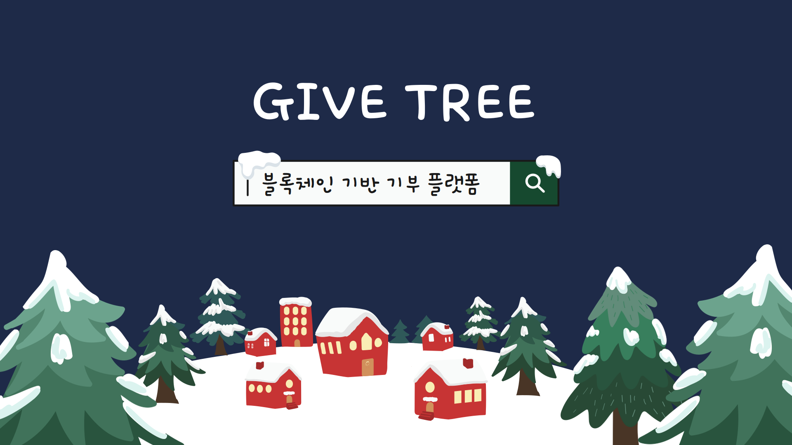
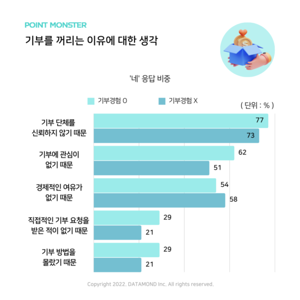
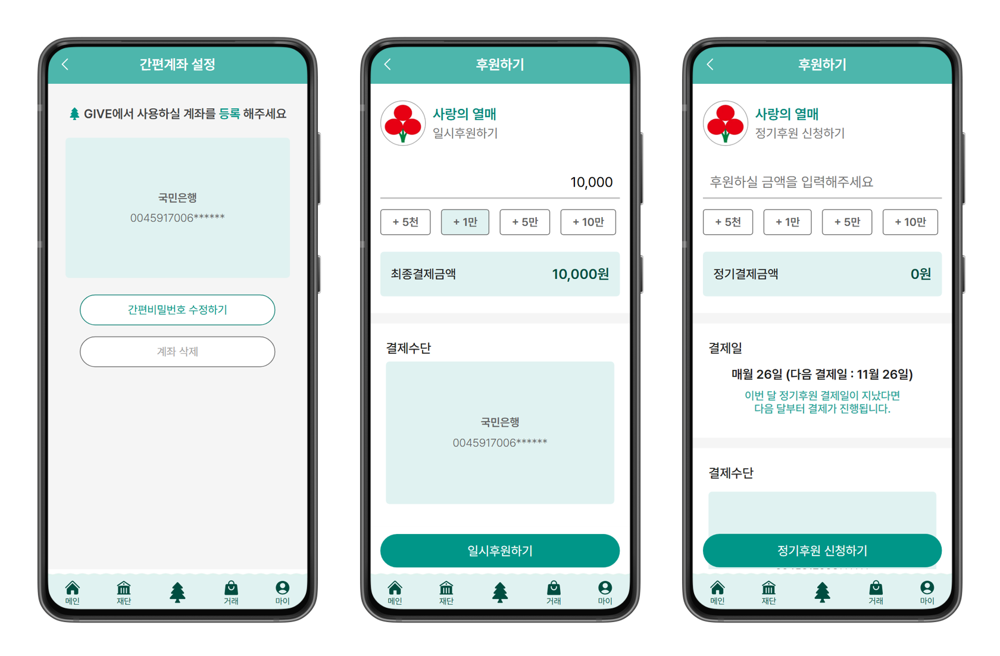
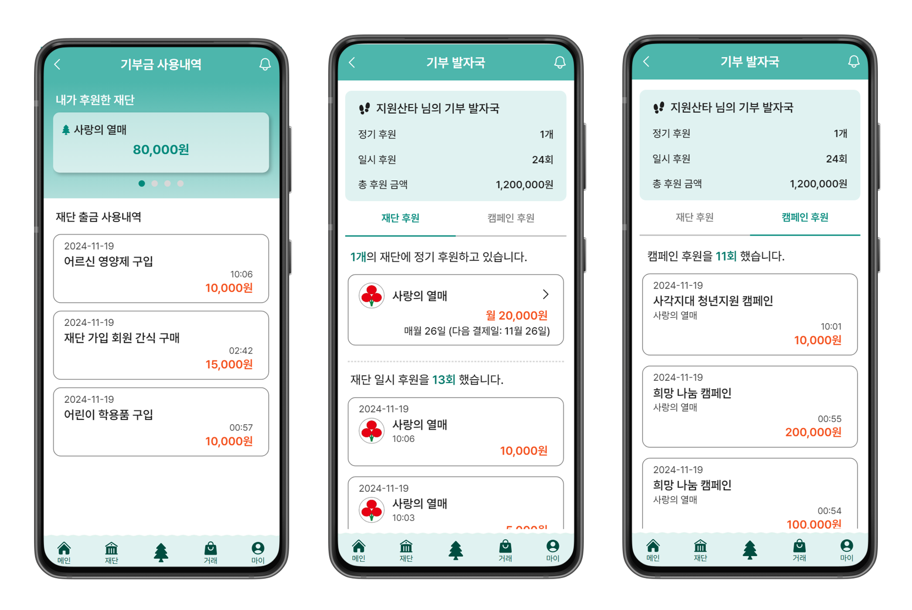
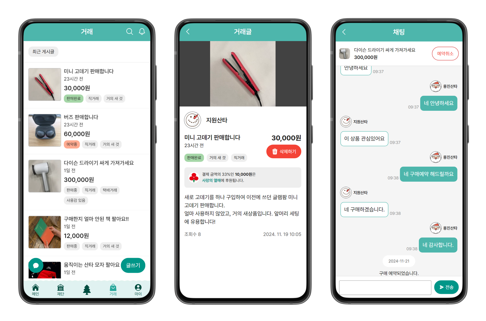
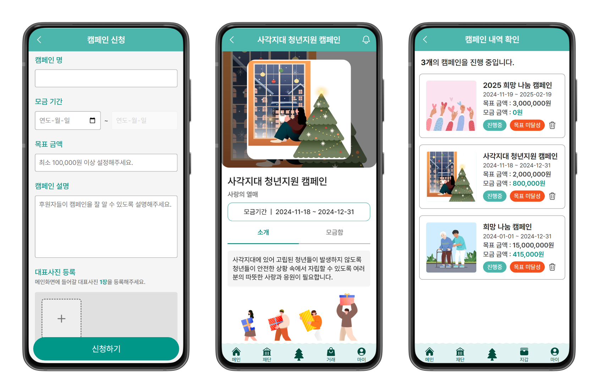
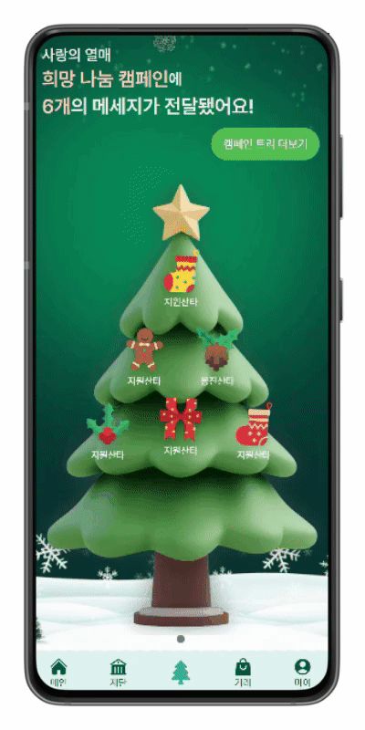
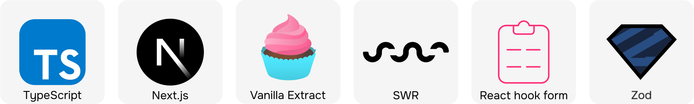
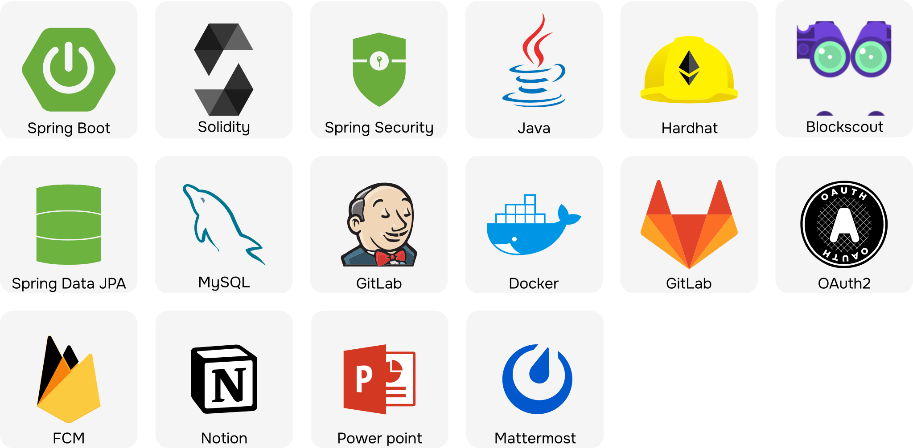
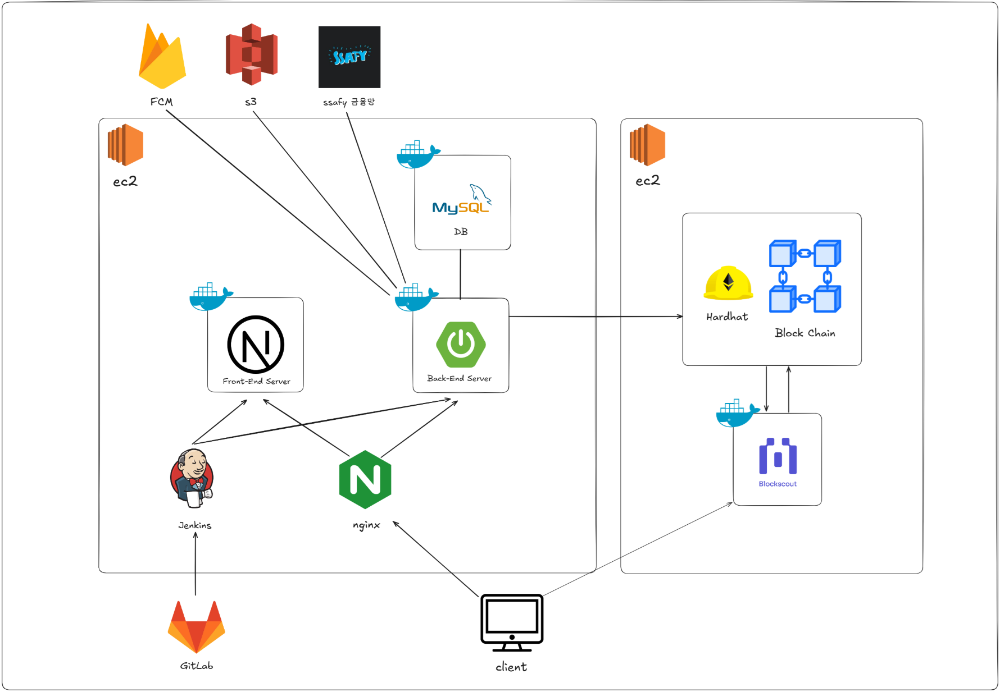

## 프로젝트 개요

SSAFY 11기 2학기 자율 프로젝트

2024년 10월 14일 ~ 2024년 11월 19일

## 서비스 소개

**블록체인 기술을 활용하여 기부금 사용의 투명성을 보장하고,** 

**중고거래 연계를 통해 쉽게 기부에 참여할 수 있는 편리한 기부 플랫폼**

### 🎄서비스명 & 로고

---

   **: GIVE(주다, 기부) + TREE(성장, 상생)**

### ❔ 프로젝트 기획 배경

---

### ✨ 프로젝트 목표

---

1. 블록체인의 투명성을 도입하여 기부 신뢰도 상승
2. 간접적인 기부 시스템으로 기부 참여 유도
3. 캠페인 활성화 및 기부 문화 확산

## 주요 기능

### 💳 계좌 연동을 통한 간편한 기부

### 🫧 기부 내역의 투명한 공유

### 🛍️  물품 판매 수익금의 일부 기부

### 🎄 캠페인 개설 및 트리 응원 메세지

## 기술 스택

**[FE]**

**[BE]**

## 아키텍처

## 🧑‍🤝‍🧑팀원

### 다르다 팀 소개
|FE|FE|FE|BE|BE|BE|
|:---:|:---:|:---:|:---:|:---:|:---:|
|[조소연](https://github.com/soyeoning)|[윤지원](https://github.com/dbe0717)|[김다운](https://github.com/kimdw524)|[권용진](https://github.com/sarmsoo)|[이유승](https://github.com/yuseung0429)|[신재민](https://github.com/hamsteak1488)|
|||||||
